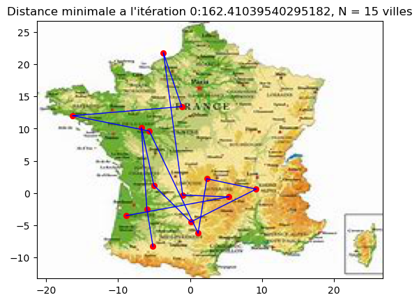
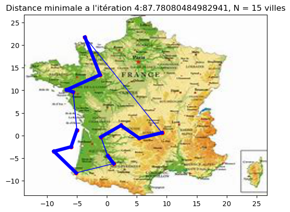
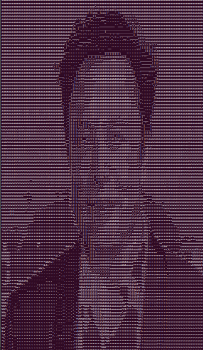
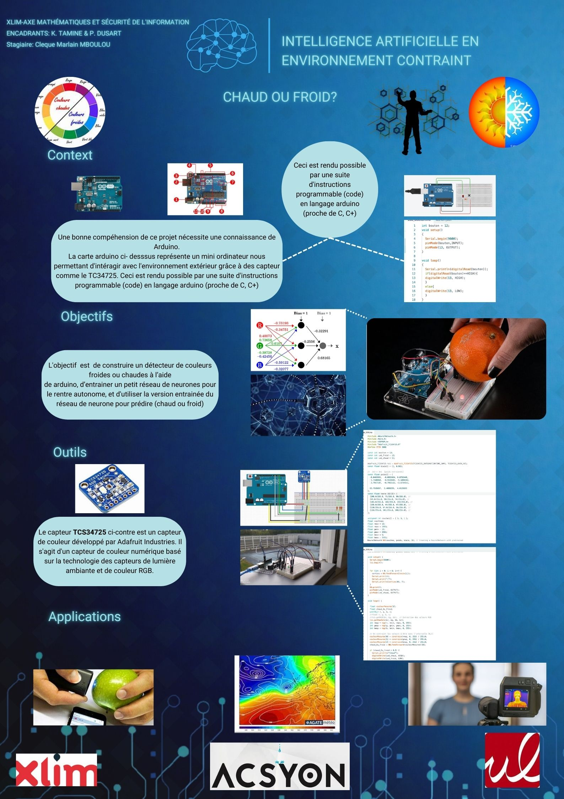

# Projet de Master 1 en Mathématiques Appliquées au service de l'Intelligence Artificielle, parcours Algorithmique Calcul Symbolique et Optimisation Numérique (ACSYON)

Ce dépôt contient les différents projets réalisés dans le cadre du Master 1 en Mathématiques Appliquées pour l'Intelligence Artificielle.

## Projets

### TP Detection de Spams

Détection de Spams à l'aide d'un réseau de neurone et d'un Classifieur Naïf Bayésien.

- Fichiers :
  - TP_Detection_de_spams.ipynb
  - TP_Detection_de_spams.pdf

Ce TP porte sur la détection de spams à l'aide de méthodes d'apprentissage automatique.

### TP Projet Voyageur de Commerce

Dans ce projet, nous allons étudier deux approches pour résoudre le problème du voyageur de commerce : un algorithme de colonie de fourmis et un algorithme génétique

- Fichiers :
  - TP_Projet_Voyageur_de_commerce.ipynb
  - TP_Projet_Voyageur_de_commerce.pdf
  - 
Chemin le plus court pour visiter 14 ville une et une seule fois (2 ieme image)

 

    
    

### Processus Stochastique & Outils Statistique

- Fichiers :
  - Outils_Statistique.pdf
  - Processus_stochastique.pdf

Cette partie du projet traite des processus stochastiques et des outils statistiques utilisés en intelligence artificielle.

### Programmation & Algorithmique

ASCII ART:

    
    

Ce projet était une initiation au langage C++, le but était de transformer une image en image ASCII

### Rapport de Stage de Master 1

- Fichiers :
  - Le_Rapport_de_Stage_de_Master_1.pdf

Ce rapport décrit le stage réalisé dans le cadre du Master 1 en Mathématiques Appliquées pour l'Intelligence Artificielle.

### Poster Stage M1

- Fichiers :
 

Ce poster résume les principales conclusions et résultats du stage réalisé dans le cadre du Master 1.

---

Ce README.md fournit une vue d'ensemble des différents projets inclus dans ce dépôt. Pour plus de détails sur chaque projet, veuillez consulter les fichiers correspondants.
